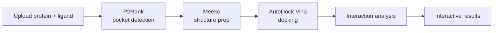

# PocketDock

**An automated, web-based molecular docking pipeline.**

PocketDock combines [P2Rank](https://github.com/rdk/p2rank) for binding pocket prediction with [AutoDock Vina](https://vina.scripps.edu/) for ligand docking, then renders the results in your browser with an interactive [3Dmol.js](https://3dmol.csb.pitt.edu/) viewer. Upload a protein and a ligand — get ranked docking poses with detailed binding-site interaction analysis a few minutes later.

## What you can do with PocketDock

-   :material-target: **Predict binding pockets**

    P2Rank scans the protein surface and ranks druggable pockets by probability — no need to know the binding site in advance.

-   :material-atom: **Dock ligands automatically**

    AutoDock Vina docks your ligand into the top *N* pockets and returns up to 9 ranked poses per pocket with binding affinities in kcal/mol.

-   :material-cube-scan: **Analyze interactions interactively**

    Inspect H-bonds, hydrophobic contacts, salt bridges, π-stacking, π-cation, and halogen bonds in 3D — toggle each type, customize distance thresholds, export PNGs and CSVs.

## Quick links

- [Getting Started](getting-started.md) — install with Docker and run your first job
- [Concepts](concepts.md) — what pockets, poses, and binding affinities actually mean
- [The Results Page](user-guide/results.md) — tour of every panel and control
- [Interpreting Results](interpreting-results.md) — how to read the affinity, combined score, and Kd estimates
- [API Reference](api.md) — script PocketDock from Python or curl

## How the pipeline works

Each stage runs as a [Celery](https://docs.celeryq.dev/) task; the web UI polls the job status every 5 seconds and redirects to the results page when docking completes.

## License

PocketDock is released under the [MIT License](https://github.com/ozsari/pocketdock/blob/main/LICENSE).
