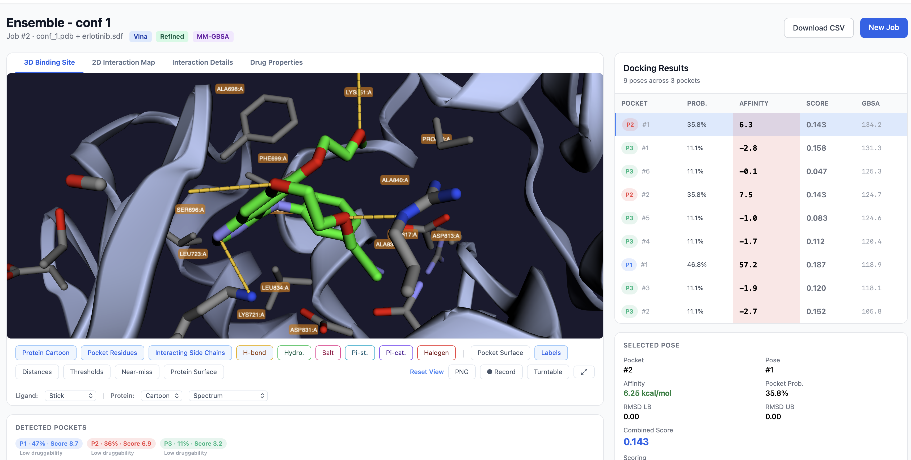
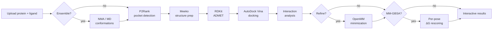

# PocketDock

**An automated, web-based molecular docking pipeline.**

PocketDock combines [P2Rank](https://github.com/rdk/p2rank) for binding pocket prediction with [AutoDock Vina](https://vina.scripps.edu/) for ligand docking, then renders the results in your browser with an interactive [3Dmol.js](https://3dmol.csb.pitt.edu/) viewer. Upload a protein and a ligand — or a whole batch of ligands — get ranked docking poses with detailed binding-site interaction analysis a few minutes later.

## What you can do with PocketDock

-   :material-target: **Predict binding pockets**

    P2Rank scans the protein surface and ranks druggable pockets by probability — no need to know the binding site in advance.

-   :material-atom: **Dock single ligands or batches**

    Submit one ligand for a focused run, or up to 100 in a single batch — multi-molecule SDFs are split automatically and tracked on a batch dashboard.

-   :material-vector-curve: **Ensemble docking**

    Generate 2–10 receptor conformations with normal-mode analysis (NMA, ~30 s) or short OpenMM MD (5–15 min), then dock across all of them with consensus scoring.

-   :material-pill: **ADMET property panel**

    Every job ships with RDKit-computed drug-likeness descriptors — MW, logP, TPSA, QED, plus Lipinski and Veber pass/fail flags.

-   :material-tune: **Pose refinement & MM-GBSA rescoring**

    Optionally minimize each pose with OpenMM (AMBER14 + implicit solvent), and add an MM-GBSA-style per-pose ΔG column to the results table.

-   :material-cube-scan: **Analyze interactions interactively**

    Inspect H-bonds, hydrophobic contacts, salt bridges, π-stacking, π-cation, and halogen bonds in 3D — toggle each type, customize distance thresholds, export PNGs and CSVs.

## Quick links

- [Getting Started](getting-started.md) — install with Docker and run your first job
- [Concepts](concepts.md) — what pockets, poses, and binding affinities actually mean
- [The Results Page](user-guide/results.md) — tour of every panel and control
- [Batch Docking](user-guide/batch-docking.md) — screen libraries with one submission
- [Ensemble Docking](user-guide/ensemble-docking.md) — flexible-receptor docking via NMA or MD
- [ADMET Properties](user-guide/admet.md) — read the drug-likeness panel
- [MM-GBSA Rescoring](user-guide/mmgbsa-rescoring.md) — opt-in per-pose ΔG
- [Interpreting Results](interpreting-results.md) — how to read the affinity, combined score, and Kd estimates
- [API Reference](api.md) — script PocketDock from Python or curl

## How the pipeline works

Each stage runs as a [Celery](https://docs.celeryq.dev/) task; the web UI polls the job status every 5 seconds and redirects to the results page when docking completes.

## License

PocketDock is released under the [MIT License](https://github.com/gozsari/PocketDock/blob/main/LICENSE).
