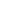
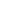

# 3D Viewer Controls

The 3D viewer is built on [3Dmol.js](https://3dmol.csb.pitt.edu/) and renders the protein, the docked ligand pose, and color-coded interaction lines. This page is the full reference for every control.

## Mouse and touch controls

| Action | Mouse | Trackpad / touch |
|--------|-------|------------------|
| **Rotate** | Left-click + drag | One-finger drag |
| **Pan** | Right-click + drag (or `Ctrl` + click + drag on macOS) | Two-finger drag |
| **Zoom** | Scroll wheel | Pinch |
| **Inspect atom** | Click an atom | Tap an atom |

Clicking an atom opens a popup with element symbol, residue, chain, and coordinates.

## Protein representation

The **Protein** style controls how the receptor is drawn:

| Style | Description |
|-------|-------------|
| **Cartoon** *(default)* | Standard ribbon-and-arrow secondary structure |
| **Ribbon** | Smoothed C-α trace with width |
| **Tube** | Thin uniform tube along the backbone |
| **Trace** | C-α line trace, no thickness |

A **Show cartoon** toggle lets you hide the backbone entirely (useful when focusing on pocket residues).

## Protein coloring

| Scheme | Description |
|--------|-------------|
| **Spectrum** *(default)* | Rainbow N-terminus → C-terminus |
| **Secondary structure** | Helix / sheet / loop colored separately |
| **Hydrophobicity** | Kyte–Doolittle hydrophobicity per residue |
| **B-factor** | Crystallographic B-factor (heat map) |
| **Chain** | One color per chain |

## Ligand representation

| Style | Description |
|-------|-------------|
| **Stick** *(default)* | Bond-thickness lines, no atom spheres |
| **Ball & Stick** | Spheres at atoms + sticks for bonds |
| **Sphere** | Space-filling spheres (CPK) |

## Pocket and surface toggles

| Toggle | Effect |
|--------|--------|
| **Pocket residues** | Show residues within 5 Å of the ligand as sticks |
| **Pocket surface** | Render the molecular surface around the binding site, colored by P2Rank probability (red = high, blue = low) |
| **Protein surface** | Render the full protein molecular surface (semi-transparent) |

The pocket surface is the most useful: it gives you a sense of pocket geometry without obscuring the ligand.

## Labels and distances

| Toggle | Effect |
|--------|--------|
| **Distances** *(on by default)* | Draw dashed lines between interacting atoms with distance labels in Å |
| **Labels** | Show atom and residue labels at hover positions |

## Camera controls

| Button | Action |
|--------|--------|
| **Reset view** | Return to the auto-fitted starting camera |
| **Fullscreen** | Expand the viewer to the entire window; the sidebar collapses behind a toggle |
| **Save PNG** | Download the current 3D view as a PNG image |

In fullscreen mode the results sidebar slides out of view; click the chevron at the right edge to bring it back without exiting fullscreen.

## Switching poses

Click any row in the results table to load that pose. The previous ligand model is removed and the new one is loaded from `/api/jobs/<job_id>/files/<pose_file>` — the camera does not reset automatically (use **Reset view** if you want to refit). Loaded poses are cached in the browser, so flipping back and forth between poses you've already viewed is instantaneous.

## Switching pockets

Pockets are selected indirectly: each row in the results table belongs to one pocket, so picking a pose from a different pocket switches the displayed pocket. The pocket surface and pocket-residue selection update automatically to follow the new ligand.

## Performance tips

- **Hide the protein surface** when rotating large structures — it's the most expensive thing to render.
- **Switch to Trace** for proteins above ~1000 residues if rotation feels laggy.
- **Disable interaction distance lines** if you have a lot of contacts and the scene is cluttered. Re-enable from the [interaction controls](interactions.md).
