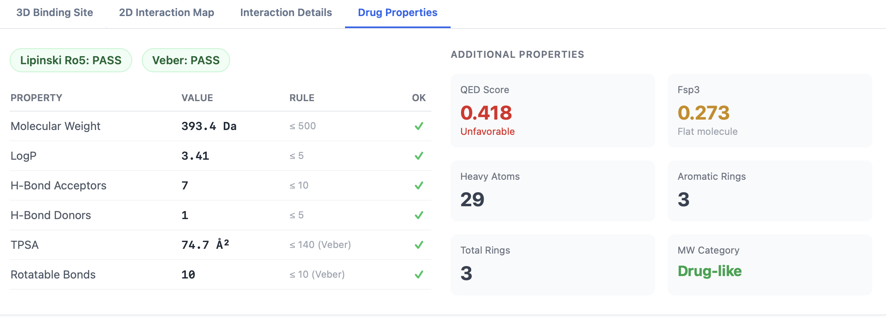

# ADMET Properties

Every PocketDock job ships with an **ADMET / drug-likeness panel** on the results page. Properties are computed automatically from the uploaded ligand with **RDKit** — no opt-in, no extra cost in runtime. The panel sits alongside the docking poses so you can sanity-check a candidate's drug-likeness at the same time you're inspecting its binding pose.


## What gets computed

PocketDock computes a focused set of RDKit descriptors that map onto common medicinal-chemistry filters:

| Descriptor | RDKit source | Typical range / notes |
|------------|--------------|-----------------------|
| **MW** | Molecular weight (Da) | Lipinski threshold: ≤ 500 |
| **logP** | Crippen logP (octanol/water partition) | Lipinski threshold: ≤ 5 |
| **HBA** | H-bond acceptor count | Lipinski threshold: ≤ 10 |
| **HBD** | H-bond donor count | Lipinski threshold: ≤ 5 |
| **TPSA** | Topological polar surface area (Ų) | Veber threshold: ≤ 140 |
| **Rotatable bonds** | Number of rotatable bonds | Veber threshold: ≤ 10 |
| **Aromatic rings** | Count of aromatic rings | — |
| **Heavy atoms** | Non-hydrogen atom count | Used in ligand-efficiency calculation |
| **Ring count** | Total ring count | — |
| **Fsp3** | Fraction of sp³ carbons | Higher Fsp3 ≈ more three-dimensional, often better drug-like |
| **QED** | Quantitative Estimate of Drug-likeness (Bickerton 2012) | `[0, 1]`. ~0.5–0.9 is typical for marketed drugs. |
| **Lipinski violations** | Count of broken Lipinski rules (0–4) | 0 is best; ≤ 1 traditionally tolerated |
| **Lipinski pass** | `true` if 0 violations | Boolean badge |
| **Veber pass** | `true` if TPSA ≤ 140 *and* rotatable bonds ≤ 10 | Boolean badge |

## Lipinski's rule of five

Christopher Lipinski's classic filter for oral bioavailability says a drug-like molecule should not violate more than one of:

- MW ≤ 500 Da
- logP ≤ 5
- H-bond donors ≤ 5
- H-bond acceptors ≤ 10

PocketDock counts how many of these four rules your ligand breaks. The **Lipinski pass** badge is green when the count is `0`.

!!! note "Failing Lipinski is not failing biology"
    Plenty of marketed drugs violate one or even two rules. Use Lipinski as a coarse triage filter for orally administered small molecules, not as an absolute go/no-go.

## Veber's rules

Veber's extension covers oral bioavailability from a different angle:

- TPSA ≤ 140 Ų
- Rotatable bonds ≤ 10

The **Veber pass** badge requires **both** conditions. Veber tends to flag flexible molecules and overly polar ones — useful when Lipinski misses something obvious.

## QED — a single drug-likeness number

QED ([Bickerton et al., 2012](https://doi.org/10.1038/nchem.1243)) collapses MW, logP, HBA, HBD, PSA, rotatable bonds, aromatic rings, and structural alerts into one number on `[0, 1]`. Rough mental model:

| QED | Interpretation |
|-----|----------------|
| `≥ 0.8` | Highly drug-like |
| `0.5–0.8` | Drug-like — most marketed oral drugs sit here |
| `0.3–0.5` | Borderline; passes some filters and fails others |
| `< 0.3` | Looks unusual for an oral drug — could still be a tool compound or non-oral candidate |

QED is the most useful single number on the panel for ranking analogues against each other.

## Supported ligand formats

ADMET computation runs the standard RDKit ligand-parsing path:

- `.sdf` (preferred)
- `.mol2`
- `.mol`

If RDKit fails to parse the ligand (bad valences, unusual atoms, missing 3D coordinates), the panel will be empty and the `admet` field in the API response will be `{}`. The docking pipeline still runs — ADMET is computed in parallel and failures are non-fatal. Check the worker logs if the panel is unexpectedly blank.

## Where to find it

### On the results page

The ADMET panel sits below the pockets summary. Each numeric value is shown alongside the relevant threshold; the **Lipinski** and **Veber** badges are colored green/red according to pass/fail.

### In the API

`GET /api/jobs/<job_id>/results/` includes an `admet` dict with all descriptors:

```python
import requests
results = requests.get("http://localhost:8000/api/jobs/42/results/").json()
admet = results["admet"]
print(f"MW = {admet['mw']:.1f} Da, logP = {admet['logp']:.2f}, QED = {admet['qed']:.2f}")
print(f"Lipinski pass: {admet['lipinski_pass']}  Veber pass: {admet['veber_pass']}")
```

See the [API reference](../api.md) for the full response schema.

### In batch screening

The batch dashboard does **not** show per-ligand ADMET — open an individual ligand's results page to see its panel, or fetch the results JSON for each job and aggregate client-side. A typical post-screening filter:

```python
hits = []
for job in batch["jobs"]:
    if job["status"] != "completed":
        continue
    r = requests.get(f"http://localhost:8000/api/jobs/{job['id']}/results/").json()
    admet = r.get("admet", {})
    if admet.get("lipinski_pass") and admet.get("qed", 0) >= 0.5:
        hits.append((job["ligand_name"], job["best_score"], admet["qed"]))
hits.sort(key=lambda x: (-x[1], -x[2]))
```

## Tips

- **Sort batch hits by QED × combined score** when you want a single ranking that balances binding and drug-likeness.
- **Don't reject borderline Lipinski violations outright** — peptidomimetics, macrocycles, and PROTACs deliberately leave Lipinski space.
- **Watch for Fsp3** — a low Fsp3 (highly flat, aromatic molecule) often correlates with poor solubility and high promiscuity, even if everything else looks fine.
- **TPSA matters for CNS targets** — for blood-brain-barrier penetration the practical threshold is closer to TPSA ≤ 90 Ų, well below Veber's 140.
- **The panel is descriptors, not ADME predictions** — no permeability, clearance, or toxicity model. For those, plug the ligand into a dedicated ADMET predictor.

## See also

- [Concepts](../concepts.md) — terminology refresher
- [Interpreting Results — ADMET](../interpreting-results.md#admet-panel) — how to read each row of the panel in context
- [Batch Docking](batch-docking.md) — combining docking ranks with ADMET filters in screening
