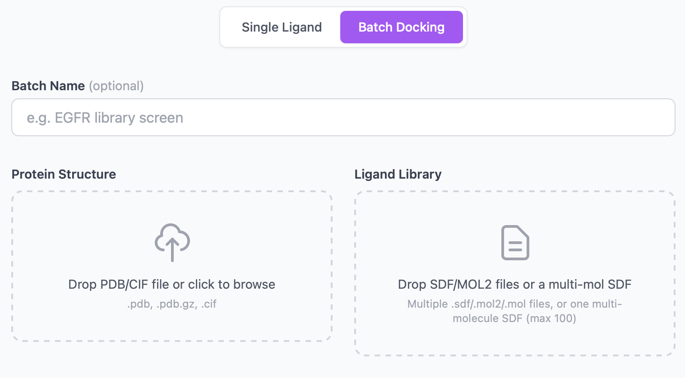
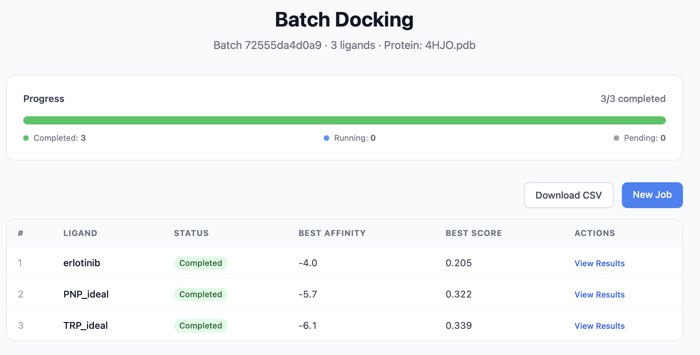

# Batch Docking

Batch docking lets you screen many ligands against the same protein in a single submission. PocketDock creates one `DockingJob` per ligand, ties them together with a shared **batch ID**, and shows progress and per-ligand best scores on a dedicated dashboard.

## When to use it

- **Library screening** — dock 10–100 candidates against the same target and rank by combined score.
- **Series exploration** — submit an SD file from your chemistry team and let PocketDock split it into one job per molecule automatically.
- **Reproducibility** — every ligand in the batch uses the **same protein, pockets, exhaustiveness, and feature flags**, so comparisons are apples-to-apples.

If you only have one or two ligands, the single-job tab is simpler — there's no batch overhead and the results page is the same.

## Submitting a batch

The upload page has two tabs: **Single Job** and **Batch**. Switch to **Batch** and you'll get:

| Field | Required | Notes |
|-------|----------|-------|
| **Batch name** | No | Free-text label. Shows in the dashboard header; defaults to empty. |
| **Protein file** | Yes | Same formats as single-job (`.pdb`, `.pdb.gz`, `.cif`, ≤ 50 MB). |
| **Ligand files** | Yes | One or more `.sdf`, `.mol2`, or `.mol` files. Up to **100** files per batch. Each ≤ 10 MB. |
| **Number of pockets** | No | `1`–`20`, default `3`. Applied to every ligand. |
| **Vina exhaustiveness** | No | `1`–`64`, default `8`. Applied to every ligand. |
| **Scoring function** | No | `vina` (default) or `vinardo`. |
| **Refine poses** | No | If checked, every job runs OpenMM minimization on its poses. |
| **MM-GBSA rescore** | No | If checked, every job adds an MM-GBSA-style ΔG column. |
| **Ensemble** | No | Optional — combines with batch (every ligand is docked across the same ensemble). |

### Multi-molecule SDF files

If a ligand file is an SDF containing more than one molecule (separated by `$$$$`), PocketDock splits it automatically and creates one job per molecule. The molecule's title line (first line of the SDF block) is used as the ligand name; falling back to `mol_1`, `mol_2`, … if the title is blank.

You can mix and match: drop a 50-molecule library SDF and three single-molecule SDFs in the same batch — you'll get 53 jobs.

### File limits at a glance

| Limit | Value |
|-------|-------|
| Maximum ligand files per submission | 100 |
| Maximum per-file size | 10 MB |
| Maximum protein size | 50 MB |

If you exceed any limit, the form returns a validation error and nothing is submitted.

## The batch dashboard

After submission you're redirected to `/batch/<batch_id>/`. The dashboard shows:

| Panel | Contents |
|-------|----------|
| **Header** | Batch name, protein filename, batch ID (the URL slug) |
| **Progress bar** | Total / completed / failed / running / pending counts and a percentage |
| **Per-ligand table** | One row per ligand: status, best Vina affinity, best combined score, link to that ligand's full results page |

The page auto-refreshes via the `/api/batch/<batch_id>/` endpoint, so you can leave it open and watch the batch finish. When `all_done` is true, the progress bar locks in.

Each row links to that ligand's regular [results page](results.md) — the per-ligand view is exactly the same as a single-job result, with the ADMET panel, 3D viewer, and interaction analysis.

## Ranking the hits

Sort the dashboard table by **best combined score** to see which ligands docked best overall, or by **best affinity** to rank by Vina score alone. For programmatic ranking, fetch `/api/batch/<batch_id>/` and sort the `jobs` array — see the [API reference](../api.md#get-batch-status).

A typical workflow:

1. Sort by best combined score, descending.
2. Inspect the top 5–10 ligands by opening each results page.
3. For survivors, check **specific interactions** (H-bonds, salt bridges with conserved residues) — a high score with no specific interactions is a red flag (see [Interpreting Results](../interpreting-results.md#putting-it-all-together)).
4. For survivors that passed step 3, check the **ADMET panel** for any non-starter properties (Lipinski violations, low QED).

## How it works under the hood

- Submitting the batch form creates one `DockingJob` per ligand, all sharing the same `batch_id` (a 12-char UUID slice).
- Each job has its own `job_dir` on disk, ligand name, and Celery task. They run independently and may complete out of order.
- The dashboard page queries `DockingJob.objects.filter(batch_id=batch_id)` and aggregates the rows.
- If you want to fan out faster, scale the Celery worker (more replicas or higher `--concurrency` — see [Configuration](../configuration.md)).

## Tips

- **Pre-clean your library** — invalid SDFs (bad valences, missing atoms) fail at the RDKit / Meeko parse step and show up as `failed` rows on the dashboard with a reason in the per-job error message.
- **Name your molecules** — set the SDF title line; it becomes the dashboard label. Anonymous molecules end up as `mol_1`, `mol_2`, … and are hard to track.
- **Start small** — run a 5-ligand pilot before submitting 100. It catches preparation issues fast and gives you a runtime estimate.
- **Disable expensive options for screening** — leave **refine poses** and **MM-GBSA rescore** off for first-pass screening (they multiply runtime per job); turn them on for the shortlist.
