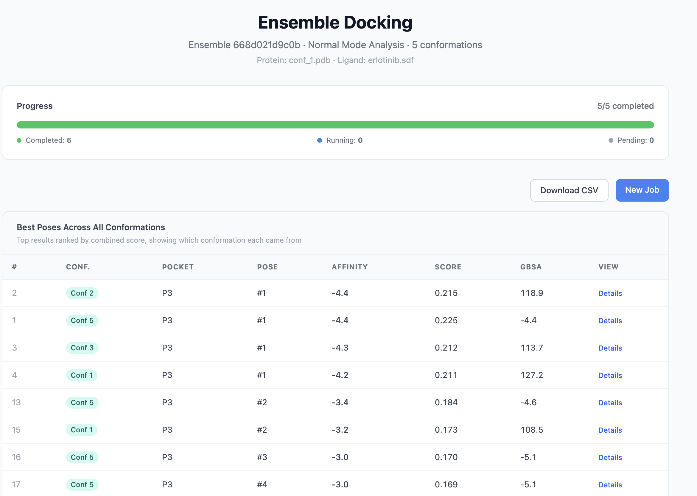

# Ensemble Docking

Ensemble docking accounts for receptor flexibility by generating several plausible conformations of the protein and docking the ligand into all of them. PocketDock offers two flavors — a fast **NMA** mode and a thorough **MD** mode — and ranks results across the ensemble with a consensus score.



## When to use it

- **Flexible receptors** — kinases, GPCRs, allosteric pockets, or any protein with mobile loops near the binding site.
- **Induced-fit hypotheses** — when the apo crystal structure may not represent the bound conformation.
- **Hit triage** — a ligand that docks well across multiple conformations is a more credible hit than one that only fits the rigid starting structure.

Single-conformation docking is fine when the receptor is rigid, the binding mode is well-characterized, or you're doing first-pass screening and runtime matters.

## Enabling ensemble docking

On the upload page (single or batch tab), tick **Enable ensemble docking** and pick a method:

| Field | Notes |
|-------|-------|
| **Ensemble method** | `NMA` (default when enabled) or `MD` |
| **Number of conformations** | `2`–`10`, default `5` |

The rest of the form (protein, ligand, pockets, exhaustiveness, optional refinement / MM-GBSA) is unchanged — those settings apply to every conformation in the ensemble.

## NMA mode — fast and conservative

**Method**: Anisotropic Network Model (ANM) on the Cα atoms, implemented with NumPy/SciPy (no ProDy dependency).

**Details**:

- Hessian built from the Tirion harmonic potential with a **15 Å Cα–Cα cutoff** and force constant **γ = 1.0**.
- Diagonalize and keep the **20 lowest non-trivial normal modes** (or fewer for very small proteins).
- For each requested conformation, perturb the structure along a chosen mode with a scaled amplitude (1.5–3.0 Å Cα RMSD range), alternating sign.
- Output: N PDB files representing low-frequency, collective backbone motions of the receptor.

**Runtime**: roughly **30 seconds** for 5 conformations on a typical kinase-sized protein. Scales linearly with `num_conformations` and atom count.

**Use NMA when**:

- You want a quick sense of how robust a docking result is to receptor breathing.
- The protein is large and MD-based sampling would be too slow.
- You're screening a batch and runtime per job matters.

NMA captures slow, collective motions but not local side-chain rearrangements — those need MD or explicit flexible-side-chain docking (not currently supported).

## MD mode — thorough and slower

**Method**: short Langevin molecular dynamics with OpenMM and PDBFixer.

**Details**:

- PDBFixer cleans the input structure (adds missing residues and hydrogens).
- Force field: **AMBER14-all** + **OBC2 implicit solvent**.
- Energy minimization (max 200 iterations) before sampling.
- Langevin integrator at **300 K**, 1 ps⁻¹ friction, **4 fs timestep** with `HBonds` constraints.
- Total simulation: **20 ps** (5000 steps). N evenly-spaced snapshots are written as PDB files.

**Runtime**: roughly **5–15 minutes** for 5 conformations, depending on protein size and CPU (no GPU acceleration in the default Docker image — see the optional `celery-gpu` service in [docker-compose.yml](https://github.com/gozsari/PocketDock/blob/main/docker-compose.yml)).

**Use MD when**:

- The receptor has flexible loops that NMA can't capture (e.g., DFG flips in kinases).
- You suspect side-chain rearrangements in the pocket matter.
- You can afford the wall-clock time and want the most physically motivated conformations PocketDock can produce.

!!! warning "MD ensembles are short"
    20 ps is enough to sample local relaxation, not large-scale rearrangements. Treat the ensemble as "small perturbations around the starting structure," not as an exhaustive exploration of conformational space.

## The ensemble pipeline

```
parent job (conformation_index = 0)
   └─ generate N conformations (NMA or MD, status: running_ensemble)
       ├─ child 1 (conformation_index = 1) → P2Rank → Vina → results
       ├─ child 2 (conformation_index = 2) → P2Rank → Vina → results
       ├─ ...
       └─ child N (conformation_index = N) → P2Rank → Vina → results
```

- The **parent** job acts as the coordinator. It generates the conformations, spawns children, and immediately transitions to `completed`.
- Each **child** is a normal `DockingJob` with its own protein PDB (the perturbed conformation), its own pockets, and its own docking results.
- All jobs share an `ensemble_id` (a 12-char UUID slice).
- If you enable **MM-GBSA rescoring** or **pose refinement**, every child inherits those flags.

## The ensemble dashboard

After submission you're redirected to `/ensemble/<ensemble_id>/`. The dashboard shows:

| Panel | Contents |
|-------|----------|
| **Header** | Ensemble name, protein and ligand filenames, method (`NMA` / `MD`), conformation count |
| **Progress bar** | Total / completed / failed / running / pending counts and a percentage |
| **Consensus top 20** | The 20 highest-scoring poses across **all** conformations, sorted by combined score. Each row shows which conformation it came from. |
| **Per-conformation table** | One row per child job: status, best affinity, best combined score, plus a top-10 pose list. |

The page auto-refreshes via `/api/ensemble/<ensemble_id>/` (see the [API reference](../api.md#get-ensemble-status)).

### Consensus scoring

PocketDock's consensus is straightforward: pool every pose from every conformation, sort by `combined_score` descending, and show the top 20.

This means:

- A pose that scores well in **one** conformation can win — useful for catching a binding mode that's only accessible to a specific receptor state.
- It does **not** penalize a pose for being missing in other conformations. If you want a "binds across the ensemble" metric, count how many of the top-N entries belong to each conformation, or fetch the full per-conformation top-10 from the dashboard.

## Tips

- **Start with NMA**, especially in batch screening — get the runtime sense first.
- **5 conformations is a good default** — enough to see whether docking is conformation-sensitive without quadrupling runtime.
- **Eyeball the conformations** — open the per-conformation pose page; if all five look identical, NMA's amplitude was too small for your system and MD is more useful.
- **Combine with MM-GBSA** when triaging a small hit list — but expect long runtimes (MD × N conformations × MM-GBSA rescoring).
- **Don't ensemble-dock everything** — if a single rigid run gives a clear, plausible pose with strong interactions, the ensemble usually confirms it without changing the answer.

## See also

- [Concepts: ensemble docking](../concepts.md#ensemble-docking) — terminology refresher
- [API reference — ensemble endpoint](../api.md#get-ensemble-status) — scripting ensemble runs
- [Configuration](../configuration.md) — env vars that affect the per-conformation pipeline
