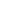
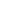
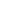

# Interaction Analysis

Each docked pose comes with an automatic geometric analysis of the protein–ligand contacts. PocketDock detects six interaction types, visualizes them in 3D, summarizes them in a 2D map, and lists every contact in a sortable table.

## The six interaction types

PocketDock detects interactions by geometry — distance and angle thresholds between specific atom types. Defaults are chosen to match the conservative end of the published literature.

| Type | Default cutoff | Color in viewer | Notes |
|------|----------------|-----------------|-------|
| **H-bond** | 3.5 Å | Yellow | Donor–acceptor distance; angle filtering applied |
| **Hydrophobic** | 4.0 Å | Green | Carbon–carbon contacts in non-polar environments |
| **Salt bridge** | 4.0 Å | Pink | Charged-group pairs (cationic + anionic) |
| **π-stacking** | 5.5 Å | Cyan | Aromatic ring centroid–centroid distance |
| **π-cation** | 6.0 Å | Purple | Aromatic ring + adjacent cationic group |
| **Halogen bond** | 4.0 Å | Red | Halogen donor → O/N acceptor |

In the 3D viewer, each detected interaction is a dashed line of the corresponding color, with a distance label.

## Customizing thresholds

Each interaction type has its own slider in the **Interaction controls** panel. Drag a slider to change the cutoff and the viewer updates immediately — interactions outside the new threshold disappear.

A **Reset to defaults** button restores all thresholds in one click.

### Near-miss toggle

Sometimes a contact is *just* outside the cutoff and you want to see it anyway. Enable **Near-miss** to also draw interactions within **120%** of each threshold (e.g., H-bonds out to 4.2 Å when the cutoff is 3.5 Å). Near-miss interactions are drawn with a dashed-and-faded line so you can tell them apart from true contacts.

## The 2D Interaction Map tab

The 2D map renders the ligand at the center with the contacting residues arranged around it, LigPlot-style. Each interaction line is colored using the same scheme as the 3D viewer:

- Distance is annotated on the line.
- Residue labels include the three-letter code, residue number, and chain.
- Aromatic π-interactions are drawn as ring–ring or ring–cation linkages.

Use **Export 2D Map PNG** at the top of the results page to save the current map as an image.

## The Interaction Details tab

The Details tab is a sortable, filterable table — one row per detected interaction:

| Column | Content |
|--------|---------|
| **Type** | H-bond, hydrophobic, salt bridge, π-stack, π-cation, halogen |
| **Ligand atom** | Atom name (e.g., `O3`) |
| **Residue** | Three-letter residue code + number + chain (e.g., `ASP142.A`) |
| **Distance (Å)** | Atom-to-atom or centroid-to-centroid distance |

A row of filter buttons above the table narrows the view:

- **All** — every interaction
- **Aromatic only** — π-stacking and π-cation
- **H-bonds only** — H-bonds and halogen bonds
- **Charged only** — salt bridges and π-cation

The **Export Interactions CSV** button exports the currently filtered view.

## When interaction detection fails silently

The interaction detector runs after Vina finishes and is wrapped in error handling — if it crashes on a particular pose (for example, an unusual residue type that can't be parsed), the failure is logged but does **not** kill the job. The pose still appears in the results table; it just won't have interactions associated with it. Check the worker logs if you see a pose with no interaction lines and you expected some.

## Tips

- **Start with defaults.** PocketDock's cutoffs are calibrated for typical drug-like ligands. Loosening them helps you spot weak contacts; tightening them produces tighter interaction sets for figures.
- **Use near-miss to find borderline H-bonds.** Crystallographic uncertainty alone is often ±0.3 Å; a putative H-bond at 3.7 Å is plausible but missed by the default 3.5 Å cutoff.
- **Filter to "Aromatic only"** when you're investigating π-stacking with kinase hinge residues or analogous aromatic clusters.
- **Compare poses** by sorting interactions by type and counting — a pose with 2 H-bonds and 5 hydrophobic contacts may be more credible than one with 0 H-bonds and 8 hydrophobic, even at the same affinity.
