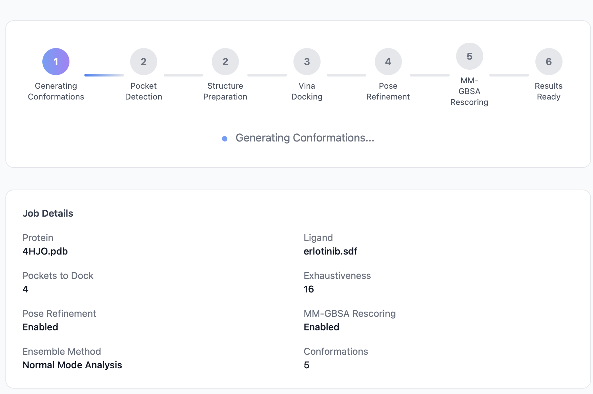

# Monitoring Progress

After submitting a job, you land on the **status page** at `/jobs/<job_id>/`. It auto-refreshes every 5 seconds and shows where the job is in the pipeline.

## The pipeline indicator

PocketDock's pipeline has four steps. Each is shown as a circle that progresses from pending → active → completed:

| # | Step | What's happening |
|---|------|------------------|
| 1 | **Pocket Detection** | P2Rank analyzes the protein surface and ranks druggable pockets |
| 2 | **Structure Preparation** | Meeko converts the protein and ligand into Vina-ready PDBQT format |
| 3 | **Docking** | AutoDock Vina runs once per pocket, generating up to 9 ranked poses each |
| 4 | **Results Ready** | Files written, database updated, page redirects automatically |

Visual states:

- **Gray** — pending (not started yet).
- **Blue, pulsing** — actively running.
- **Green checkmark** — completed.
- **Red** — the pipeline failed at this step.

## Job details panel

Below the pipeline indicator, the status page shows the parameters the job was submitted with:

- Protein filename
- Ligand filename
- Number of pockets to dock
- Vina exhaustiveness

These are read-only — to change them, submit a new job.

## Queue position when pending

If your job is still `pending` (not yet picked up by a worker), the status page additionally shows a **Queue position** panel: how many jobs are ahead of yours in line, and an estimated wait until your job starts.

The estimate assumes the worker concurrency configured via `WORKER_CONCURRENCY` (default 2) and uses a rolling average of the last 20 completed jobs as the per-job duration. See [Queue](queue.md) for the full formula and limitations.

The panel disappears as soon as your job moves to a running stage — at that point the pipeline indicator above tells you everything you need.

## Polling and auto-redirect

The status page reloads itself every 5 seconds (using a meta-refresh, not JavaScript polling — works even with JS disabled). Behind the scenes:

- If `status` is still `running_*` or `pending`, the page just refreshes.
- If `status` becomes `completed`, the browser is redirected to the results view of the same URL.
- If `status` becomes `failed`, the page renders an error banner with the failure message.

If you want to poll programmatically instead, use the [API](../api.md#get-job-status).

## Failures

When the pipeline fails, the status page shows a red banner with the error message captured from the failing stage. Common causes are documented in [Troubleshooting](../troubleshooting.md):

- **P2Rank found no pockets** — the protein may have no predicted druggable site; try a different chain or structure.
- **Failed to prepare receptor / ligand** — file format or chemistry issue.
- **Vina failed on a pocket** — *not* fatal; the pipeline continues with the remaining pockets and only that pocket is missing from the results.

Errors are truncated to 2000 characters and stored on the `DockingJob` record — they're available via the [status API](../api.md#get-job-status) as well.

## How long should a job take?

A rough guide for default settings (`exhaustiveness=8`, 3 pockets):

| Protein size | Ligand size | Expected runtime |
|--------------|-------------|------------------|
| Small (~150 residues) | Small (~20 heavy atoms) | 2–4 min |
| Medium (~300 residues) | Medium (~30 heavy atoms) | 4–8 min |
| Large (~500+ residues) | Large (~50 heavy atoms) | 8–15 min |

Doubling exhaustiveness roughly doubles the docking time. The hard ceiling is the Celery task time limit of **3600 seconds** (configurable; see [Configuration](../configuration.md)).

## Sharing a job

The job URL — `http://<your-host>/jobs/<job_id>/` — is permanent and unauthenticated. Anyone with the URL can view the status and (when complete) the results. There is no "delete" button in the UI; jobs persist until manually removed from the database and `media/` directory.
