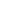
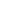
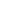

# The Results Page

The results page is where you spend most of your time in PocketDock. It's a two-column layout: an interactive 3D viewer on the left, and a sortable results table with detail panels on the right.

## Page layout

| Region | Contents |
|--------|----------|
| **Left (≈ 65% width)** | 3D viewer with three tabs — **3D Binding Site**, **2D Interaction Map**, **Interaction Details** |
| **Right sidebar** | Results table, selected pose info, detected pockets summary, export buttons |

The active row in the results table drives everything else: the 3D viewer loads the selected pose, the pose info panel updates, and the interaction tabs show that pose's contacts.

## The results table

One row per docked pose. With default settings (3 pockets × up to 9 poses) you'll see up to 27 rows.

| Column | Description | Sortable |
|--------|-------------|----------|
| **Pocket** | Pocket rank badge (`1`, `2`, …) and pose number within that pocket | Yes |
| **Prob.** | Pocket probability (P2Rank), shown as a percentage | Yes |
| **Affinity** | Vina binding affinity in kcal/mol — more negative is better | Yes |
| **Score** | [Combined score](../interpreting-results.md#combined-score) (0–1) — default sort | Yes |

Click any column header to sort. Click a row to load that pose into the viewer and update the detail panels.

### Visual cues

- The **Affinity** cell has a green-gradient background — strong binding (more negative kcal/mol) is darker green; weak binding fades to white.
- The **Score** value is colored: green for `> 0.6`, yellow for `0.3–0.6`, gray for `< 0.3`.
- The selected row is highlighted; hover shows a subtle background change.

## Selected pose info panel

Below the table, the **Selected Pose** panel summarizes the currently active pose:

| Field | Meaning |
|-------|---------|
| **Pocket** | Which pocket the pose is in |
| **Pose** | Pose number (1 = best, up to 9) |
| **Affinity (kcal/mol)** | Vina score for this pose |
| **Pocket Probability (%)** | P2Rank score for the parent pocket |
| **RMSD LB / UB** | Lower / upper bound of the pose-uncertainty RMSD vs. the best pose in the same pocket |
| **Combined Score** | Weighted blend of pocket probability and normalized affinity |
| **Ligand Efficiency** | `−affinity / heavy_atoms` — annotated as Good / Moderate / Poor |
| **Binding Strength** | Estimated dissociation constant (Kd) and a strength category (Very Strong → Very Weak) |

See [Interpreting Results](../interpreting-results.md) for how each number is calculated and what to make of it.

## Detected pockets summary

The pockets PocketDock chose to dock against are listed as badges:

Each badge shows:

- **Pocket rank** (e.g., `Pocket 1`)
- **Probability** as a percentage
- **P2Rank score**
- **Druggability** — derived from the probability:
    - `> 80%` → **Highly druggable**
    - `50–80%` → **Moderately druggable**
    - `< 50%` → **Low**
- **Composition bar** — stacked horizontal bar showing the residue-type breakdown of the pocket lining: hydrophobic, polar, positive, negative, special.

These let you eyeball whether a pocket looks plausible (for example, a pocket dominated by hydrophobic residues with a positive ligand may be a poor match).

## Exports

Three export buttons sit at the top of the results page:

- **Download CSV** — the full results table with columns: `pocket_rank`, `pocket_probability`, `pose_rank`, `affinity_kcal_mol`, `rmsd_lb`, `rmsd_ub`, `combined_score`.
- **Export 2D Map PNG** — saves the current 2D interaction diagram as a PNG.
- **Export Interactions CSV** — saves the detailed per-interaction table for the selected pose.

You can also right-click the 3D viewer and use the in-canvas **Save image as** option to export the current 3D view as PNG (also available as a button in the viewer toolbar).

## Sharing the results

The page URL is stable and shareable: `http://<host>/jobs/<job_id>/`. Anyone with the link can view the same results, including the interactive 3D viewer (the underlying PDB and PDBQT files are served from `/api/jobs/<job_id>/files/<path>`). There's no per-job authentication, so don't post links publicly if your input structures are confidential.

## Where to next

- [3D Viewer Controls](3d-viewer.md) — every button and toggle in the viewer
- [Interaction Analysis](interactions.md) — the 2D map, interaction details tab, distance thresholds
- [Interpreting Results](../interpreting-results.md) — what the affinity, score, LE, and Kd numbers actually mean
