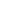
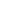

# Uploading a Job

The upload page is the entry point to PocketDock. It's a single form with two file drop zones and an optional advanced settings panel.

## Form fields

| Field | Required | Notes |
|-------|----------|-------|
| **Job name** | No | Free-text label for your records. Defaults to `<protein>_<ligand>` if blank. |
| **Protein file** | Yes | The receptor structure. See [supported formats](#protein-formats) below. |
| **Ligand file** | Yes | The small molecule to dock. See [supported formats](#ligand-formats) below. |
| **Number of pockets** | No | How many top-ranked P2Rank pockets to dock against. `1`–`20`, default `3`. |
| **Vina exhaustiveness** | No | Vina's search depth. `1`–`64`, default `8`. |

## Supported file formats

### Protein formats

| Extension | Description | Max size |
|-----------|-------------|----------|
| `.pdb` | Protein Data Bank format | 50 MB |
| `.pdb.gz` | Gzipped PDB | 50 MB |
| `.cif` | mmCIF (macromolecular CIF) | 50 MB |

If your file fails the validation, the form returns:

> Protein file must be PDB (.pdb), gzipped PDB (.pdb.gz), or mmCIF (.cif).

### Ligand formats

| Extension | Description | Max size |
|-----------|-------------|----------|
| `.sdf` | Structure-Data File | 10 MB |
| `.mol2` | Tripos MOL2 | 10 MB |
| `.mol` | MDL Molfile | 10 MB |

PocketDock parses ligands with **RDKit** and prepares them for docking with **Meeko**. If your ligand can't be parsed, the job will fail with `RDKit failed to read ligand file` or `Meeko failed to prepare the ligand molecule`. See [Troubleshooting](../troubleshooting.md#ligand-preparation-failures) for common causes.

## Advanced settings

### Number of pockets

Controls how many of P2Rank's predicted pockets to dock against. The pockets are ranked by P2Rank probability, so `Number of pockets = 3` means "dock into the three most druggable predicted sites."

- **Lower** (1–2): Faster — useful when you already know roughly where the binding site is and just want a sanity check.
- **Default** (3): Reasonable trade-off between coverage and runtime.
- **Higher** (5–10+): Useful when the binding site is unknown or when you want to see how a ligand fares across multiple potential sites.

Each additional pocket adds one Vina run — total runtime scales roughly linearly with this parameter.

### Vina exhaustiveness

Vina's exhaustiveness controls how many independent Monte Carlo + local-optimization runs are performed inside the docking box. Higher values reduce the chance of missing a low-energy pose at the cost of runtime.

- **Default** (8): Recommended for most jobs and screening workflows.
- **16**: Use when the ligand is highly flexible (≥ 8 rotatable bonds) or when reproducibility matters across reruns.
- **32+**: Use only when chasing the global minimum on a hard system. Runtime grows roughly linearly with exhaustiveness.

## Drag-and-drop UX

Both file drop zones accept either drag-and-drop or click-to-browse. Once a file is dropped, its filename appears in the zone and the icon changes to indicate selection. To replace a file, drop a new one on top — the previous selection is replaced.

## After submission

When you click **Run Docking**:

1. The form is submitted as a multipart POST to `/api/jobs/`.
2. The server creates a `DockingJob` record, saves the files under `media/jobs/<random-id>/`, and queues a Celery task.
3. You're redirected to `/jobs/<job_id>/` — the [status page](monitoring.md).

If the upload fails validation (wrong format, too large), you stay on the upload page with an error banner.

## Tips

- **Pre-clean your protein** if it contains things you don't want docked against — alternate conformations, crystal waters, ions, ligands from the original crystal structure. PocketDock dockers against whatever atoms are in the file.
- **Use a single chain** when the biological assembly is a homodimer. Otherwise P2Rank may report symmetric pockets twice.
- **Protonate the ligand** at physiological pH before uploading. Vina assumes the protonation state in your file is correct.
- **Center coordinates aren't needed** — PocketDock derives the docking box automatically from each predicted pocket's geometry (controlled by the `VINA_BOX_PADDING` and `VINA_DEFAULT_BOX_SIZE` env vars; see [Configuration](../configuration.md)).
